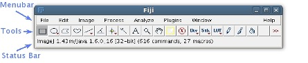

# Synapse Labeling Guideline Using FIJI
1. Install FIJI
    - You can download and install FIJI by following the guideline in this page: https://imagej.net/Fiji/Downloads
2. Labeling
    1) Open a 2 or 3-channel image file to label in FIJI
    2) Click ‘Image > Color > Make Composite’ on the Menu bar to make the image into a composite image
    3) Find synapses to label
        - Using Zoom in/out, z-scroll and scrolling tool may make this process easier. Check the APPENDIX for the shortcuts. 
    4) Switch to blue channel (3rd channel) by moving ‘C’ scroll bar on the bottom of the image
        - If you have a 2 channel image, create a third ‘blue’ channel by
            1. Image > Color > Split Channel
            2. File > New > Image; make a new stack with the same width, height, and number of slices as your original 2 channel image
            3. Image > Color > Merge Channel; allocate the new image you created to C3 and allocate the red and green split images to their appropriate channels
    5) Paint synapse pixel by pixel using ‘Pencil Tool’ on the Tools bar
        - Before painting, make sure the blue channel is selected (bottom scrollbar). If so, the painted pixels should be colored in blue
        - If the boundary of the synapse is ambiguous due to excess signal from the red channel, then open ‘Image > Color > Channel Tools…’ (Ctrl + Shift + Z) and toggle off ‘Channel 1’ (the red channel) to see only the green and blue channels
        - Undo (Ctrl + Z) is not working. If you paint a wrong pixel accidently, you need to use ‘Eraser Tool’ on the toolbar to fix it.
    6) Click ‘File > Save As > Tiff…’ on the Menu bar to save the labeled image once you’ve done with labeling

3. Tutorial video

    <iframe src="https://youtu.be/mjSKwDLQ7qw" frameborder="0" allow="accelerometer; clipboard-write; encrypted-media; gyroscope; picture-in-picture" allowfullscreen></iframe>

4. Useful shortcuts of FIJI

| Function | Keys |
| -------- | ---- |
| Open files | Ctrl+O, drag-and-drop files on the status bar |
| Zoom In/Out | +/-, Ctrl+Scroll |
| Z-scroll | Alt+Scroll |
| Scrolling tool | Press space and drag |
