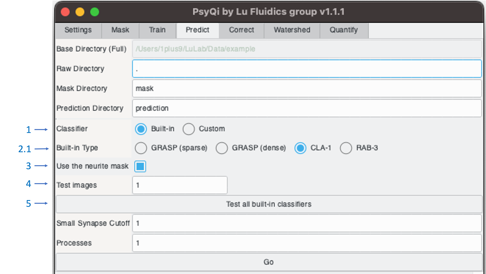

# WormPsyQi Running Guide

## How to Start
Refer to the [readme](./README.md#run-the-pipeline) to launch the pipeline GUI.
***

## GUI
### Table of Contents

1. [Main GUI](#main-gui)
2. [Settings](#settings)
3. [Mask](#mask)
4. [Train](#train)
5. [Predict](#predict)
6. [Correct](#correct)
7. [Quantify](#quantify)
***
### Main GUI

>
<i>Figure 1:</i> Main GUI

The main GUI comprises two panels as seen in [Figure 1](#figure1).
1. Control panel
    * Configure parameters and initiate processing in this panel
    * Includes multiple tabs at the top
        * [Settings](#settings) tab
            * Define parameters
            * Execute all steps with one-click
        * [Mask](#mask) ~ [Quantify](#quantify) tabs
            * Verify the parameters
            * Execute a single step
2. Log panel
    * Logs will be displayed in this panel
    * Format: `[<log level>] <timestamp> - <message>`
***
### Settings

>
<i>Figure 2:</i> <b>Settings tab before selecting a base directory.</b> Note that <i>‘Base Directory (Full)’</i> and <i>‘Raw Directory’</i> fields are highlighted in red, indicating that input is required. Once a value is inputted, they will turn normal. Also, <i>‘Channel Order (raw)’</i> and <i>‘Channel Name’</i> fields are void until the <i>‘Base Directory (Full)’</i> field is filled.

>
<i>Figure 3:</i> <b>Settings tab after selecting a base directory.</b> Note that the dropdown lists and text have appeared next to <i>‘Channel Order (raw)’</i> and <i>‘Channel Name’</i> fields.

1. Base Directory
    - The base directory is where the user has input data and where PsyQi will save output data.
        1) Select Base Directory: Open a base directory selection dialog (see [Figure 4](#figure4)) that enables users to select a base directory.
        2) Base Directory (Full): After selecting a base directory in the dialog, the full path of the selected directory appears in the text box. Users can also directly edit the text.

>
<i>Figure 4:</i> <b>Base directory selection dialog</b>

2. Raw Directory
    - The Raw directory is a subdirectory that contains the input microscopy images.
    - After the base directory is selected, PsyQi automatically surveys all the directories in the base directory including ‘.’, the base directory itself, and presents them in a drop-down list. Select the folder where your raw images are stored from the list.
    - The text next to the drop-down list displays the number of image files in the selected directory.
3. Mask Directory
    - The ‘Mask’ process saves its output in this directory. (See [Mask](#mask) tab for details)
    - The default value is ‘mask’.
4. Prediction Directory
    - The ‘Predict’ process saves its output in this directory. (See [Predict](#predict) tab for details)
    - The default value is ‘prediction’.
5. Correction Directory
    - The ‘Correct’ process saves its output in this directory. (See [Correct](#correct) tab for details)
    - The default value is ‘prediction_corrected’.
6. Quantification Directory
    - The ‘Quantify’ process saves its output in this directory. (See [Quantify](#quantify) tab for details)
    - The default value is ‘quantification’.
7. Channel information
    - In this section, users must provide accurate information about the channel order of the raw images.
        1) Channel Order (raw)
            - Users must specify the channel order of the raw images here. Once a raw directory is selected, PsyQi reads the metadata of the first image file in the raw directory and creates the same number of drop-down lists as the number of color channels in the image. For each channel, users can pick an option among ‘None’, ‘Synapse’, ‘Neuron’, and 'Bright-field’ (see [Figure 5](#figure5)). Choosing the correct options is essential for the subsequent processes.
            - For example, if the first channel shows the neuronal marker, the second channel shows synapses, and the third channel shows bright-field, then ‘Neuron’, ‘Synapse’, and ‘Bright-field’ should be selected in that specific order.
        2) Channel Name
            - This section provides additional information about the channels by reading the metadata from the first image file in the raw directory.

>
<i>Figure 5:</i> <b>Channel Order dropdown menu</b>

8. Small Synapse Cutoff
    - In the prediction process, segmented synapses of equal or less volume than this cutoff value will be eliminated.
    - The default value is 1, which will eliminate single-voxel synapses. If you do not want to eliminate any synapses, set this value as 0.
9. Processes
    - This field indicates the number of processes to use. To maximize performance, check the number of logical processors your machine has (Task Manager->Performance->CPU->Logical Processors) and input that number in the text box.
    - The default value is 1.
10. ‘Do all...’ button
    - Executes all steps sequentially. However, each step can be performed separately in the other tabs.
***

### Mask

>
<i>Figure 6:</i> <b>Mask tab</b>

In the mask step, the pipeline takes raw images from the raw directory and segments out neurites, generating binary mask images in the mask directory. If there are already mask images in the mask folder, PsyQi will bypass them instead of reprocessing them.

<b>Additional Parameters</b>
1. Masking Method
    - This pipeline provides three different methods for masking. The default is the 'UNet (neurite.pt)' method.
        1) UNet (neurite.pt)
            - This method uses a deep-learning network called U-Net designed for biomedical image segmentation. It's slow but accurate. You can install CUDA 10.2 to speed up this method.
        2) UNet (multi_scale.pt)
            - Similar to the previous method, but this method segments out neurites and synapses simultaneously. Note that its accuracy in neurite segmentation is lesser than the previous one.
        3) Edge detection
            - This method uses a conventional edge-detection-based method. It's faster than UNet wihtout GPU but less accurate.
***

### Train
During the training step, the pipeline uses synapse label images and their corresponding original images from the label directory to train a pixel classifier. Label images should be named after the original image with the prefix '_label' (for example, 'Image 1.czi' for the original and 'Image 1_label.tif' for the label). Once training is complete, the classifier is serialized and saved in the train directory. These files can be reused in the future to bypass the labeling and training steps. The 'Classifier Model' dropdown menu allows for the selection of a model for your classifier. By default, the 'Random Forest' model is selected due to its robustness and speed. However, this step can be skipped if the user intends to use the built-in classifiers for synapse segmentation.

<b>Additional Parameters</b>
1. Label Directory
    - The 'Train' process takes input files from this directory. One or more hand-labeled synapse images and corresponding raw images are required to do the ‘Train’ process. If you are not familiar with hand-labeling, see [labeling_guide](./labeling_guide.md).
    - The default value is ‘label’.
2. Classifier Directory
    - The 'Train' process writes the output in this directory.
    - The default value is 'classifier'.
3. Classifier Model
    - Here, you can choose the type of classifier. The default value is 'Random Forest', which is generally most robust and the fastest. ‘Kernel SVM’ is robust but relatively slow with larger training datasets. ‘AdaBoost’ is not fully optimized yet, but it is considerably faster than SVM.

***
### Predict
In the prediction step, the pipeline takes 1) raw images from the raw directory, 2) neurite masks from the mask directory, and 3) a pixel classifier either selected from the built-in classifiers or a custom classifier from the classifier directory as input. It generates binary synapse prediction images as output into the prediction directory.

<b>Additional Parameters</b>
1. Classifier
    - Choose to use either one of the built-in classifiers or a custom classifier.
2. Classifier option
    - If the ‘Built-in’ option is selected, users will need to further select from the radio buttons (see [Figure 7](#figure7)) If the ‘Custom’ option is selected, users need to specify the directory where the serialized classifier is located (see [Figure 8](#figure8))
    1) Built-in Type
        - PsyQi provides four different types of built-in classifiers. ‘GRASP (sparse)’ is optimized to segment sparsely expressed GRASP puncta. ‘GRASP (dense)’ is optimized to segment densely expressed GRASP puncta. The expected radius of the synaptic puncta for these classifiers is 1-5 pixels. ‘CLA-1’ is optimized to segment CLA-1 GFP puncta, which usually have a larger radius than GRASP. ‘RAB-3’ is optimized to segment more diffused fluorescent signals.
    2) Custom Classifier Dir.
        - Enter the directory name containing the serialized classifier created in the training step.
3. Use the neurite mask
    - If checked, synaptic puncta outside of the neurite mask from the mask step will be removed.
4. Test all built-in classifiers
    - By activating this option, PsyQi will generate synapse segmentation results for the first two images in the raw directory using all available built-in classifiers. This feature allows users to manually assess the outcomes and determine whether to employ a default model or to proceed with training a custom one. The results will be place in the prediction directory. For clarity in subsequent operations, it's recommended that these results be removed before moving to subsequent steps.

>
<i>Figure 7:</i> <b>Predict tab with ‘Built-in’ is selected in the Classifier menu</b>

>
<i>Figure 8:</i> <b>Predict tab with ‘Custom’ is selected in the Classifier menu</b>

***
### Correct
In the correction step, the pipeline takes the predicted synapse images from the prediction directory and corrects them using a separate GUI, the Synapse Corrector. The Synapse Corrector offers a convenient visualization of segmentation results and provides synapse-wise rejection/regional rejection functionality. The corrected results are saved in the correction directory, but users can change the save directory in the Synapse Corrector. See [synapse_corrector](./synapse_corrector.md) for more information.

***
### Quantify

>
<i>Figure 9:</i> <b>Quantify tab</b>

In the quantification step, the pipeline takes the segmented synapse images from the "Quantification In Dir." directory and generates the quantification results in the "Quantification Out Dir." directory. These results include the position and size of each synapse, and some basic statistics such as the average number of synapses.

<b>Additional Parameters</b>
1. Quantification In Dir.
    - Specify the directory where the segmented images you want to quantify are located.
2. Quantification Out Dir.
    - Specify the directory where the quantification results will be placed.
***