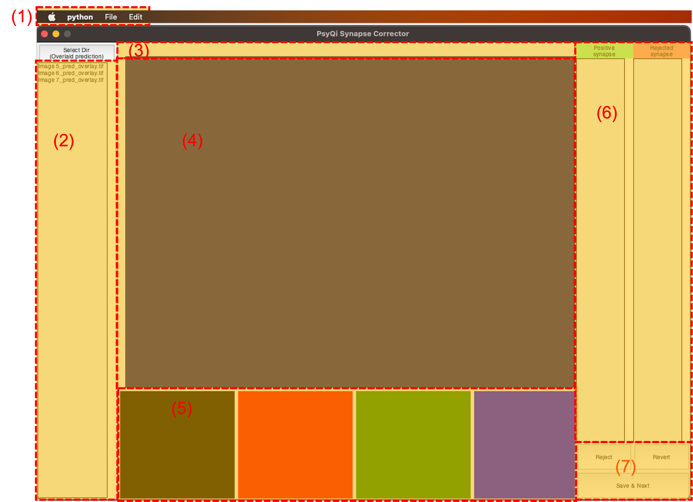
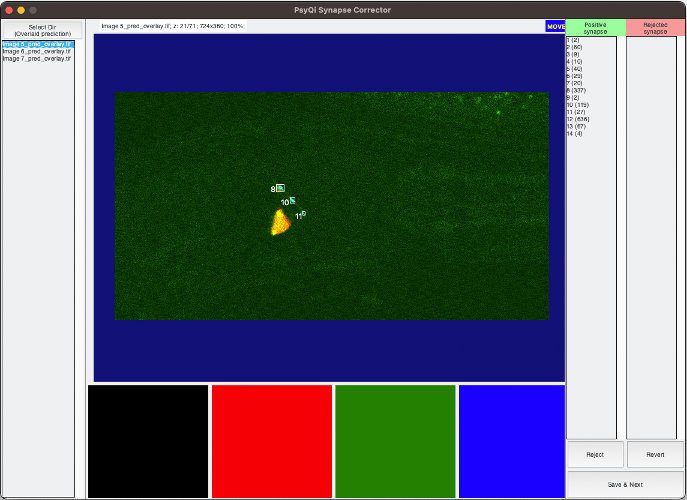
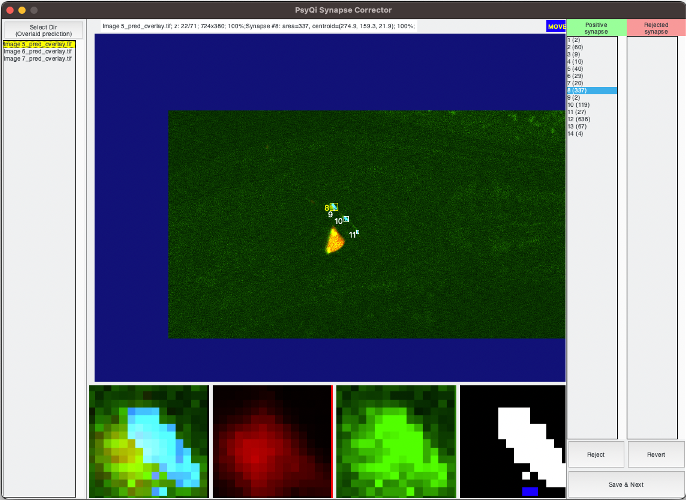

# Synapse Corrector GUI Running Guide

## Getting Started
Please refer to the [readme](README.md) for instructions on launching the primary GUI. Upon successful initialization, navigate to the 'Correct' tab and click the 'Go' button to open the Synapse Corrector GUI. Ensure that your 'Prediction Directory' contains the results of the synapse segmentation process. The 'Correction Directory' is the designated location where the corrected labels will be saved.
***

## Exploring the Synapse Corrector GUI

>
<i>Figure 1:</i> The Synapse Corrector GUI prior to image loading

The Synapse Corrector GUI, as displayed in [Figure 1](#figure1), is composed of several components:
1. Menu bar
2. Image list
3. Status bar
4. Main image panel
5. Synapse highlight panel
6. Synapse list
7. Button panel

***

## Workflow Overview
### Load an image
Upon launching the Synapse Corrector through the primary GUI, the image files from the prediction directory will be displayed in the image list. Should you wish to process images from a different directory, simply click the "Select Dir" button located above the image list to open a directory selection dialog.

Images can be loaded for processing by double-clicking their corresponding names in the list.

>
<i>Figure 2:</i>The Synapse Corrector GUI with an image loaded

As shown in [Figure 2](#figure2), the GUI with a loaded image displays information such as the image name, current z slice, image size, and current zoom rate in the status bar. The current action mode ('MOVE' or 'DRAW') is also displayed at the right end of the status bar. The table below summarizes the various actions available to users.

| Mode | Action | Mouse | Keyboard |
| -----| ------ | ------ | --------- |
| Both | Move up/down z slice | Scroll up/down | <[>, <]> |
| Both | Show/hide synapse bounding box | - | \<B> |
| Both | Zoom in/out | - | <+>, <-> |
| Both | Switch mode | - | \<Space> |
| Both | Select a synapse | Double click on a synapse | - |
| Move | Move image | Left click and drag | - |
| Draw | Draw a selection box | Left click and drag | - |
| Draw | Remove the selection box | Left click | - |
| Both (when a selection box exists) | Open a popup menu 1 | Right click | - |
| Both (when a selection box exists) | Open a popup menu 2 | \<Shift> + Right click | - |

### Select a synapse
You can select a synapse by double-clicking it in the main image panel or in the synapse list. When a synapse is selected, either from the image or from the synapse list, the highlight panel displays a 15x15 box around the center of the synapse as illustrated in [Figure 3](#figure3). The panel exhibits the composite image, red channel, green channel, and binary segmentation result from left to right. In the binary segmentation canvas, black pixels are background, white pixels are selected synapses and blue pixes are other synapses.

>
<i>Figure 3:</i> Synapse Corrector GUI after selecting a synapse

### Accept or reject synapse

Upon selection of a synapse, its state can be altered. For a positive synapse, it can be rejected and moved to the right panel of the synapse list, with the bounding box and ID label turning red. For a rejected synapse, it can be reinstated as positive. The presence of a selection box enables users to open a popup menu to either accept or reject all synapses inside or outside the selection box. Please refer to the provided tables for the full list of actions possible when a synapse is selected. 

| Action | Mouse | Keyboard |
| ------ | ----- | -------- |
| Move to the center of the selected synapse | Double-click the current selected synapse | \<Ctrl+F> |
| Accept the current synapse and select the next synapse in the list | Click 'Revert' button in the button panel | \<Ctrl+A> |
| Reject the current synapse and select the next synapse in the list | Click 'Reject' button in the button panel | \<Ctrl+R> |

### Saving Your Progress and Advancing to the Next Image

Once you have successfully corrected your synapses, it's time to save your progress. This can be easily achieved by clicking the "Save & Next" button in the button panel or by using the keyboard shortcut <Ctrl+S>. Upon saving, the system will automatically load the next image in the image list, ensuring a smooth and efficient workflow.

### Exploring Additional Features
The Synapse Corrector GUI comes with a set of extra functionalities available under the "Edit" menu in the menu bar. One of these is the "Edit contrast" option, which opens a dedicated window for adjusting image contrast, thus enabling better visualization and precision in correction.

Other functions, "Remove small blobs" and "Remove large blobs", facilitates the exclusion of all synapses under or over a certain volume threshold. This feature can be especially useful for focusing on more significant synapses and eliminating potential noise and autofluorescence.

The Synapse Corrector GUI is designed with an evolving nature in mind. We plan to continually incorporate more features and improvements in the future to better meet your needs. We invite you to explore and utilize these tools for an enhanced user experience.

Thank you for choosing our Synapse Corrector GUI, and we wish you a smooth journey in your image correction tasks!

***